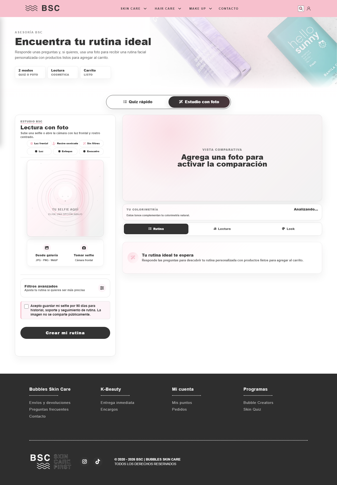
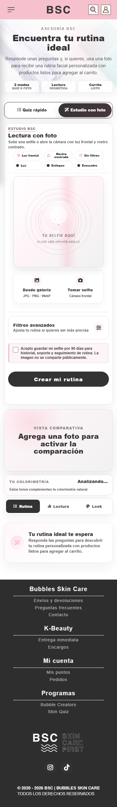
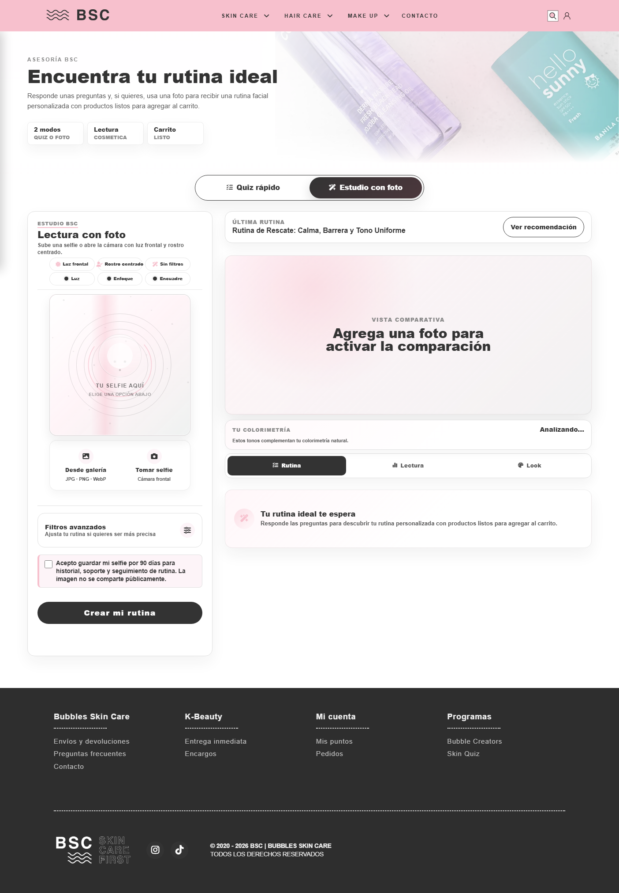
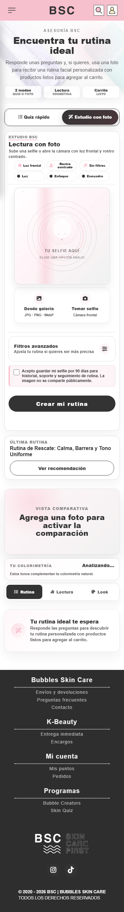

# Skin Quiz con foto - reporte visual de cierre

Fecha: 2026-06-13  
Alcance: solo tab `Estudio con foto`. El tab `Quiz rapido` queda fuera del alcance y no fue redisenado.

## Capturas finales

Desktop final:

Mobile final:

Estado con `Ultima rutina` forzado:

## Tickets ejecutados

- [x] SKQ-AI-01: checklist, preview y acciones usan una misma columna visual.
- [x] SKQ-AI-02: placeholder de selfie simplificado, con menos ruido visual y mejor contraste.
- [x] SKQ-AI-03: checklist superior ajustado para ser mas escaneable en desktop y mobile.
- [x] SKQ-AI-04: acciones de foto convertidas en barra alineada al preview, no cards flotantes.
- [x] SKQ-AI-05: `Colorimetria` y tabs separados por 8px.
- [x] SKQ-AI-06: empty state de rutina iguala el ancho de tabs/panel y elimina el desfase por scrollbar.
- [x] SKQ-AI-07: estado `Ultima rutina` auditado en desktop y mobile con mismo ancho del panel derecho.
- [x] SKQ-AI-08: comparador vacio reducido en peso visual y altura.
- [x] SKQ-AI-09: mobile flow compactado en comparador y columna foto alineada.
- [x] SKQ-AI-10: espaciado normalizado alrededor de 8px componente, 16px grupo y 24px seccion.

## Metricas finales

Desktop 1404px:

- Checklist: `x=112 w=320`
- Preview: `x=112 w=320`
- Acciones foto: `x=112 w=320`
- Colorimetria a tabs: `8px`
- Tabs: `x=510 w=832`
- Empty state: `x=510 w=832`
- Overflow horizontal: `no`
- Input nativo de file: `no visible`

Mobile 390px:

- Checklist: `x=45 w=300`
- Preview: `x=45 w=300`
- Acciones foto: `x=45 w=300`
- Comparador vacio: `204px` de alto
- Colorimetria a tabs: `8px`
- Tabs: `x=14 w=362`
- Empty state: `x=14 w=362`
- Overflow horizontal: `no`
- Input nativo de file: `no visible`

Estado `Ultima rutina` forzado:

- Desktop: saved banner `x=510 w=832`, compare `x=510 w=832`
- Mobile: saved banner `x=14 w=362`, compare `x=14 w=362`

## Validacion

- [x] `npm run lint:scss`
- [x] `npm run compile:css`
- [x] `node tools/check-css-build-sync.js`
- [x] Playwright desktop/mobile screenshot final
- [x] Playwright desktop/mobile screenshot con rutina guardada
